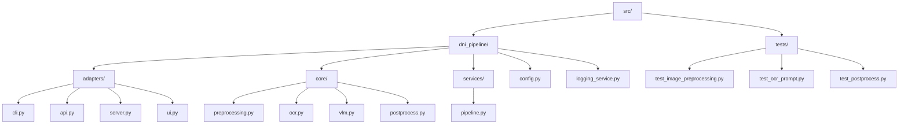

# Pipeline DNI OCR + Qwen3-VL

## Descripción
- Pipeline local que combina docTR (OCR) y Qwen3-VL-8B-Instruct (VLM) para extraer los campos clave de un DNI español a un JSON estructurado.
- Todo el procesamiento se ejecuta en local para preservar la privacidad: se carga la imagen, se obtiene el bloque OCR auxiliar y se consulta el modelo multimodal con instrucciones estrictas.
- El repositorio sigue estándares profesionales de ingeniería Python (pyproject.toml, tests automáticos, `Makefile`, CLI empaquetada y servidor local).

## OCR fuerte + bloque de contexto
El módulo de OCR fuerte genera los artefactos que necesita el VLM:
- `ocr_items`: lista plana de tokens con `text`, `bbox` y `confidence`, ordenada por lectura natural.
- `[OCR] ... [/OCR]`: bloque textual resultante tras filtrar tokens con baja confianza (`≈0.4`) y agruparlos por línea. Prioriza el recall y, en esta versión, proviene únicamente de la vista global preprocesada (sin sub-ROIs adicionales).

No se generan diccionarios heurísticos ni se depende de keywords: toda la inferencia estructurada recae en Qwen, que recibe la imagen normalizada y el bloque `[OCR]`. Los logs mantienen la trazabilidad (tokens brutos vs. filtrados, contenido final del bloque) y, si la métrica de enfoque cae por debajo del umbral (`focus < 25` o `low_focus`), el pipeline corta la ejecución con el mensaje `necesito nueva foto`.

### Postprocesado con validación
Tras la inferencia del VLM se lanza un segundo pase con Qwen3-VL-8B-Instruct actuando como “cleaner + validator”:
- Recibe el bloque `[OCR]`, el JSON crudo del VLM y un prompt con reglas explícitas (regex del NIF, checksum, formatos de fechas, vocabularios permitidos…).
- Devuelve un JSON estructurado con `fields.<campo> = { value, confidence, errors }`, una lista `manual_review` y notas opcionales.
- Si un campo crítico (`dni`, `fecha_validez`, `nacionalidad`) queda con `confidence: "low"`, se añade automáticamente a `manual_review` para revisión humana.
- Se guarda un `trace` por registro con el `[OCR]`, la salida bruta del VLM, el prompt usado para la limpieza y la respuesta del validador para poder auditar cualquier incidencia. Cuando falta la letra de control del DNI, el validador la reconstruye con el checksum oficial (`raw_dni_digits` + `meta.reconstructed_letter=true`) y baja la confianza a `medium/low` para que quede constancia.

### Preprocesado geométrico y fotométrico
Antes de invocar a docTR se aplica un pipeline de normalización que refuerza imágenes difíciles y perfila el DNI incluso cuando ocupa una fracción pequeña del fotograma:
- **Detección y recorte del documento**: Canny + contorno cuadrilátero. Si se encuentran las cuatro esquinas se aplica una homografía y se proyecta a un lienzo canónico (`1400x900 px`). Cuando no hay contorno fiable, se toma el bounding box luminoso, se amplía con margen y se reescala/pad a blanco.
- **Corrección de perspectiva y zoom**: la imagen rectificada sirve como base para la orientación automática; además se calcula un `vlm_zoom_image` aprovechando `document.quad` para obtener una vista “only DNI” que se guarda en `data/output/`.
- **Normalización fotométrica**: antes de la homografía se recorta el ROI original con padding, se aplica un `unsharp mask` leve (radio 1.2, amount 0.6) y después se realiza el warp; sobre la vista ya rectificada sólo se aplican CLAHE suave y denoise bilateral para estabilizar el contraste sin volver a desenfocar.
- **Sin pasadas adicionales de ROI**: el OCR se alimenta únicamente de la vista global mejorada; ya no se generan recortes específicos (por ejemplo, del NIF vertical) para docTR.
- **Métricas de calidad**: se calculan focus (varianza del Laplaciano) y luminancia media; los avisos (`low_focus`, `poor_lighting`, `document_area_small`, etc.) quedan en la metadata y, en el caso del enfoque, condicionan la validez del resultado.

El resultado de esta fase alimenta la orientación automática, la vista OCR, la imagen cuadrada del VLM y los artefactos que se escriben en `data/output/` para cada captura.

## Estructura del proyecto
```
├── Makefile
├── data/
│   ├── input/
│   └── output/
├── models/
├── pyproject.toml
├── requirements.txt          # Apunta al paquete instalado en modo editable
├── scripts/
│   ├── run_pipeline.py
│   └── run_server.py
├── src/
│   └── dni_pipeline/
│       ├── __init__.py
│       ├── adapters/
│       │   ├── api.py            # FastAPI + Gradio UI
│       │   ├── cli.py            # CLI de extracción
│       │   ├── server.py         # Entrypoint uvicorn
│       │   └── ui.py             # Componentes Gradio
│       ├── core/
│       │   ├── preprocessing.py  # Normalización, recortes, métricas
│       │   ├── ocr.py            # Envoltura de docTR
│       │   ├── vlm.py            # Llamadas a Qwen3-VL-8B
│       │   └── postprocess.py    # Cleaner y validaciones
│       ├── services/
│       │   └── pipeline.py       # Orquestación de etapas
│       ├── config.py             # Settings tipados del pipeline
│       └── logging_service.py
└── tests/
    ├── test_image_preprocessing.py
    ├── test_ocr_prompt.py
    └── test_postprocess.py
```



## Requisitos
- Python 3.10 o superior.
- GPU NVIDIA (ej. RTX 4090) con PyTorch compilado para CUDA para obtener el mejor rendimiento; el código también puede ejecutarse en CPU (más lento).
- Acceso local a los pesos de docTR y de `Qwen/Qwen3-VL-8B-Instruct` (el proyecto no realiza llamadas a servicios externos).

## Preparación del entorno
1. Crea y activa un entorno virtual (opcional pero recomendado):
   ```bash
   python3 -m venv .venv
   source .venv/bin/activate
   ```
2. Actualiza `pip` y herramientas básicas:
   ```bash
   python -m pip install --upgrade pip setuptools wheel
   ```
3. Instala el proyecto en modo editable junto con las extras necesarias:
   ```bash
   pip install -e .[api,ui]      # servidor + UI
   pip install -e .[dev,api,ui]  # entorno completo de desarrollo
   ```

## Descarga de modelos
### docTR
docTR descarga sus pesos automáticamente en `~/.cache/doctr` la primera vez que se ejecuta el pipeline. Si trabajas en un entorno sin salida a Internet, copia previamente esos ficheros desde una máquina con acceso usando (`pip install huggingface_hub` si aún no tienes `huggingface-cli`):
```bash
huggingface-cli download mindee/doctr-dbs --local-dir ~/.cache/doctr/models
huggingface-cli download mindee/doctr-crnn --local-dir ~/.cache/doctr/models
```

### Qwen3-VL-8B-Instruct
El pipeline busca los pesos de Qwen en este orden:
1. Ruta indicada mediante `--model-path` o variable `DNI_PIPELINE_QWEN_MODEL_PATH`.
2. Directorio `Qwen3-VL-8B-Instruct/` en la raíz del proyecto.
3. `models/Qwen3-VL-8B-Instruct/`.

Descarga los pesos una única vez y colócalos en cualquiera de las rutas anteriores:
```bash
mkdir -p Qwen3-VL-8B-Instruct
huggingface-cli download Qwen/Qwen3-VL-8B-Instruct \
  --local-dir Qwen3-VL-8B-Instruct \
  --local-dir-use-symlinks False
```
> Necesitas haber hecho `huggingface-cli login` (o configurar `HF_TOKEN`) para poder descargar el modelo. Si prefieres otro directorio, exporta `DNI_PIPELINE_QWEN_MODEL_PATH=/ruta/a/Qwen3-VL-8B-Instruct` antes de lanzar la CLI o el servidor.
> Alternativamente, puedes descargar manualmente los ficheros desde la página oficial de Hugging Face (`https://huggingface.co/Qwen/Qwen3-VL-8B-Instruct`) y descomprimirlos en `Qwen3-VL-8B-Instruct/` o en la ruta que vayas a referenciar con `--model-path`.

## Instalación rápida
```bash
# Dependencias principales
make install

# Entorno completo para desarrollo, API y UI
make install-dev
```
> Si prefieres hacerlo manualmente: `pip install -e .` y añade extras como `.[dev]` o `.[api,ui]` según lo necesites.

## Uso de la CLI
Una vez instalado el paquete, ejecuta:
```bash
dni-pipeline --image path/to/dni.jpg
```
Parámetros relevantes:
- `--ocr-max-side`: tamaño máximo del lado más largo antes del OCR (1600 por defecto).
- `--vlm-size`: tamaño del lienzo cuadrado para el VLM (512 por defecto).
- `--max-new-tokens`: tokens generados por Qwen (256 por defecto).
- `--model-path`: ruta local a los pesos de Qwen si no están en los directorios por defecto.
- `--disable-card-crop`: desactiva el recorte automático del documento; por defecto siempre se genera y se guarda la vista “only DNI”.
- `--verbose`: muestra logs `DEBUG`.

### Uso directo del script
`scripts/run_pipeline.py` evita el paso de instalación y añade la carpeta `src/` al `PYTHONPATH` automáticamente. Resulta útil para pruebas rápidas o para ejecutar el código en entornos donde no puedes instalar el paquete.

Ejemplos:
```bash
# Procesar una sola imagen
python scripts/run_pipeline.py --image data/input/samples/photo10.jpg \
  --model-path ./Qwen3-VL-8B-Instruct \
  --max-new-tokens 128 \
  --verbose

# Procesar un directorio completo y guardar los JSON en data/output/
python scripts/run_pipeline.py --input-dir ./data/input/samples \
  --output-dir ./data/output \
  --vlm-size 640 \
  --ocr-max-side 1800
```
Parámetros disponibles (idénticos a la CLI instalada):
- `--image` / `--input-dir`: modo individual o batch.
- `--output-dir`: carpeta donde se guardan los `.json` (si no se indica, solo se imprime por stdout).
- `--model-path`: ruta local al modelo Qwen; si se omite, usa las rutas por defecto descritas arriba.
- `--ocr-max-side`, `--vlm-size`, `--max-new-tokens`, `--disable-card-crop`, `--verbose` y resto de flags expuestos en `dni-pipeline --help`.

Cada imagen procesada produce:
- Un JSON (stdout + `output_dir`) donde cada campo esperado incluye `value`, `confidence`, `errors` y, cuando aplica, metadatos (`raw_dni_digits`, `meta.reconstructed_letter`, etc.). Fechas se entregan en ISO (`AAAA-MM-DD`), el DNI siempre se normaliza a “8 dígitos + letra” e incluye `raw_dni_digits` para trazabilidad. Si el texto devuelto por el modelo no es JSON válido, se guarda `{"raw_output": ...}` sin tocar.
- El bloque `validations` resume checks automáticos (`dni_checksum_ok`, `fecha_*_reasonable`).
- Una sección `manual_review` (lista de campos críticos a revisar) y un bloque `trace` con todo el histórico (`raw_ocr`, JSON bruto del VLM, prompt del validador y su salida) para facilitar auditorías.
- `*_processed.png`: la vista cuadrada enviada al VLM.
- `*_vlm_zoom.png`: crop centrado en el DNI aprovechando `document.quad` (si `--disable-card-crop` no está activo).

Si la métrica de enfoque es demasiado baja, el pipeline no confía en el OCR y devuelve `{"raw_output": "necesito nueva foto"}` para evitar falsos positivos.

## Testing y calidad
- Ejecuta `make test` (o `pytest`) para lanzar los tests unitarios incluidos.
- `make lint` ejecuta Ruff sobre `src/` y `tests/`.
- `make format` intenta aplicar correcciones automáticas con Ruff.

## Despliegue local del servidor
El proyecto incluye un servidor FastAPI con interfaz Gradio opcional:
```bash
make serve
# o
dni-pipeline-server --host 0.0.0.0 --port 8000
```
El endpoint `POST /api/v1/extract` recibe el fichero del DNI y devuelve el JSON resultante. La ruta raíz monta la interfaz Gradio para pruebas manuales.
Puedes ajustar el host/puerto con variables de entorno al invocar `make`, por ejemplo `SERVER_HOST=127.0.0.1 SERVER_PORT=9000 make serve`. Usa `SERVER_ARGS="--verbose"` si necesitas pasar flags adicionales al comando de servidor.

### Exponer el servidor con ngrok
Para compartir el servidor local sin desplegar en producción puedes abrir un túnel temporal con ngrok:
1. Instala el binario desde [https://ngrok.com/download](https://ngrok.com/download) y autentícalo una sola vez: `ngrok config add-authtoken <tu_token>`.
2. Lanza el servidor junto con el túnel usando el helper incluido:
   ```bash
   make serve-tunnel                                                  # porta 8000 por defecto
   SERVER_PORT=9001 make serve-tunnel                                 # puerto alternativo
   TUNNEL_SERVER_HOST=0.0.0.0 make serve-tunnel                       # bind para accesos externos/local host
   TUNNEL_FORWARD_HOST=127.0.0.1 make serve-tunnel                     # host al que se conecta ngrok (normalmente 127)
   PYTHON=.venv/bin/python make serve-tunnel                          # usa tu intérprete del virtualenv
   NGROK_ONLY=1 make serve-tunnel                                     # sólo abre el túnel (arranca el server manualmente)
   ```
   También puedes invocar directamente el script `bash scripts/serve_with_ngrok.sh --verbose`.
3. Cuando ngrok muestre la URL `https://...ngrok.io`, compártela con el cliente externo. Ctrl+C cierra tanto el túnel como el servidor.

El script arranca uvicorn ligado a `TUNNEL_SERVER_HOST` (127.0.0.1 por defecto para minimizar superficie) pero ngrok se conecta al `TUNNEL_FORWARD_HOST` (normalmente sigue siendo 127.0.0.1). En entornos WSL/VM donde quieras aceptar también tráfico local, fija `TUNNEL_SERVER_HOST=0.0.0.0` y deja `TUNNEL_FORWARD_HOST=127.0.0.1` para que ngrok use loopback. Si prefieres lanzar el servidor manualmente, exporta `NGROK_ONLY=1` para que el helper sólo abra el túnel apuntando al puerto indicado. Como en `make serve`, puedes pasar `SERVER_ARGS` para añadir parámetros (`--model-path`, `--verbose`, etc.). Asegúrate de tener los modelos descargados antes de exponer la API.

### Depuración de subidas desde la API/Gradio
- Por defecto los archivos subidos se guardan en `/tmp` y se eliminan al finalizar cada petición. Si necesitas reproducir un fallo puntual (por ejemplo, una foto tomada desde el móvil que falla pero el fichero local funciona), exporta `DNI_PIPELINE_KEEP_UPLOADS=1` antes de arrancar el servidor. El log indicará la ruta temporal y podrás volver a ejecutar `dni-pipeline --image /tmp/tmpXXXX.jpg --verbose` para comparar el resultado o moverla a `data/debug/` para inspeccionarla. No olvides borrar los ficheros manualmente después de la investigación.

## Rendimiento y comportamiento
- Qwen3-VL-8B-Instruct se recomienda ejecutarlo en GPU (`torch.float16`). La primera inferencia puede tardar más por la carga y warm-up.
- En CPU el pipeline sigue siendo funcional, aunque la inferencia multimodal será significativamente más lenta.
- El pipeline está orientado a ejecuciones batch/nocturnas: prioridad en estabilidad, reproducibilidad y manejo seguro de campos (prefiere `null` a datos dudosos).

## Limitaciones actuales
- Optimizado para DNIs españoles; otros documentos requerirán ajustes en prompts y normalización.
- Imágenes muy deterioradas o con recortes agresivos pueden devolver campos `null` para mantener la fiabilidad.
